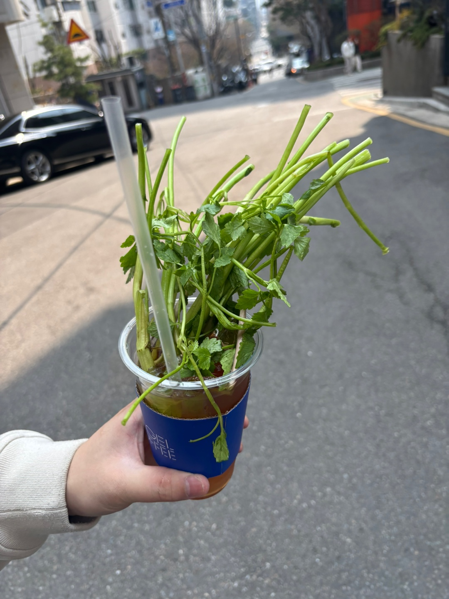
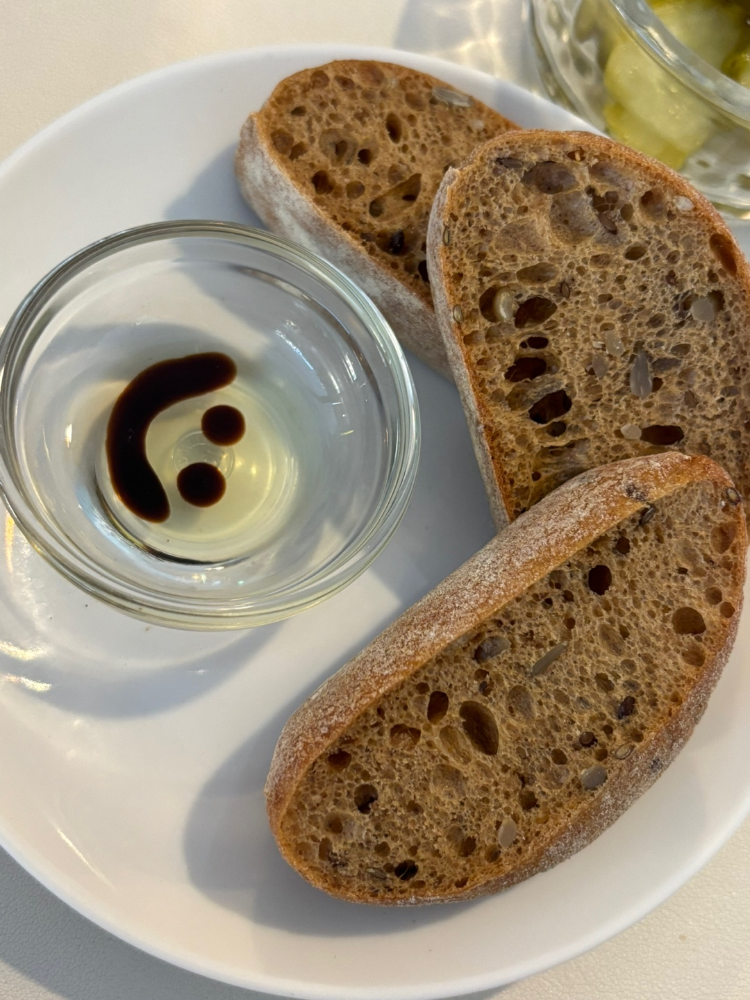

 

  만우절에만 회사앞 카페에서 팔고있는 소여물아이스티

 

<table>
  <tr>
    <td></td>
    <td></td>
    <td></td>
  </tr>
</table>

 

  2주나 일찍해준 생일파티

<table>
  <tr>
    <td></td>
    <td></td>
    <td></td>
    <td></td>
  </tr>
</table>

 

  직장 동료가 우리집 강아지들 지브리스타일로 변경해줬다 🐶

 

 

  결국 개발자는 gpt를 결제해야하는거였다

