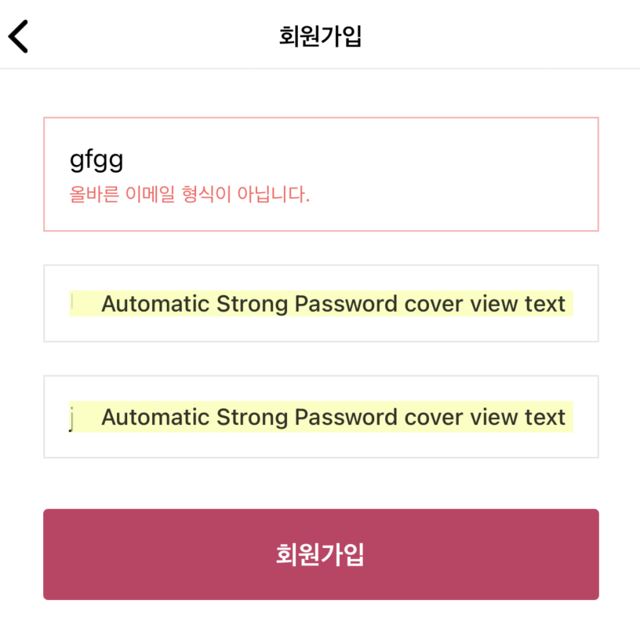

<br>

<div style='text-align:center'>
    리액트 네이티브를 사용하면서 문제점을 기록해 보려고 합니다.
</div>
 
<br>

<div style='text-align:center; font-weight:bold;'>
 1. Automatic Strong Password cover view text
</div>
 
 
<br>



<br>

<div style='text-align:center'>
TextInput에다가 secureTextEntry={true}를 주면 저런 문제가 발생할 수 있는데 해결방안은 다음과 같다.
</div>

<br>

```
textContentType = 'oneTimeCode'
```

<br>

<div style='text-align:center; font-weight:bold;'>
 2. blurOnSubmit
</div>

<div style='text-align:center'>
 최신 react-native에서는 blurOnSubmit이 사용중단이 되어 다른 것을 사용한다.
</div>

<br>

```
blurOnSubmit={false} ➡️ submitBehavior="submit"
blurOnSubmit={true} ➡️ submitBehavior="blurAndSubmit"
```
